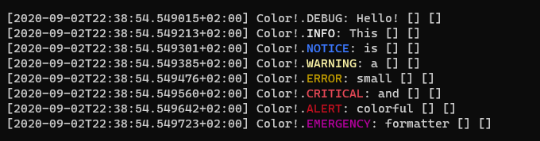
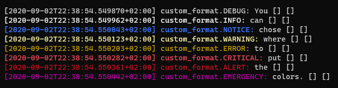
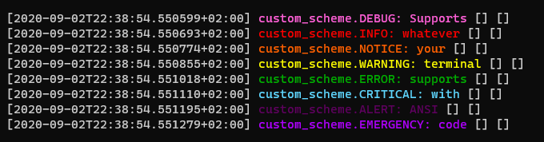

# Colored LineFormatter for Monolog
A simple Formatter that adds level-dependant colors to your logs.

## Basic usage
Use it the same way you would use a `Monolog\LineFormatter`:

```php
<?php

use Monolog\Logger;
use Monolog\Handler\StreamHandler;
use gfaugere\Monolog\Formatter\ColoredLineFormatter;

$formatter = new ColoredLineFormatter();

// Create a handler
$stream = new StreamHandler(__DIR__.'/my_app.log', Logger::DEBUG);
// Don't forget to attach your new formatter
$stream->setFormatter($formatter);
// Create a log channel
$log = new Logger('name');
$log->pushHandler($stream);

// Add records as usual
$log->warning('Foo');
$log->error('Bar');
```

## Default colors
This is what your logs will look like:  \


## Customize the format
By default, the `%level_name%` will be wrapped in colors. You can chose what is colored using the new `%color_start%` and `%color_end%` variables in your format:  \
  \
This example uses `"%color_start%[%datetime%] %channel%.%level_name%:%color_end% %message% %context% %extra%\n"` as a format.

_If you want to use several `%level_name%` and only color the first one, you can set `$colorMode` to `ColoredLineFormatter::MODE_COLOR_LEVEL_FIRST` so that only the first occurrence is formatted._

## Customize the scheme
You can chose your own color scheme:
```php
<?php

use Monolog\Logger;
use Monolog\Handler\StreamHandler;
use gfaugere\Monolog\Formatter\ColoredLineFormatter;

$format = "[%datetime%] %color_start%%channel%.%level_name%: %message%%color_end% %context% %extra%\n";
$scheme = [
    Logger::DEBUG     => "\033[38;5;206m",
    Logger::INFO      => "\033[38;5;196m",
    Logger::NOTICE    => "\033[38;5;202m",
    Logger::WARNING   => "\033[38;5;226m",
    Logger::ERROR     => "\033[38;5;34m",
    Logger::CRITICAL  => "\033[38;5;81m",
    Logger::ALERT     => "\033[38;5;53m",
    Logger::EMERGENCY => "\033[38;5;129m"
];

$formatter = new ColoredLineFormatter($format, null, false, false, $scheme);

// Create a handler
$stream = new StreamHandler(__DIR__.'/my_app.log', Logger::DEBUG);
// Don't forget to attach your new formatter
$stream->setFormatter($formatter);
// Create a log channel
$log = new Logger('name');
$log->pushHandler($stream);

// Add records as usual
$log->warning('Foo');
$log->error('Bar');
```
This formatter doesn't perform any kind of checks or validation of sequences. You can use whatever your terminal supports!  \


## About
### Requirements
Supports Monolog `^2.0`, which works with PHP 7.2 or above
